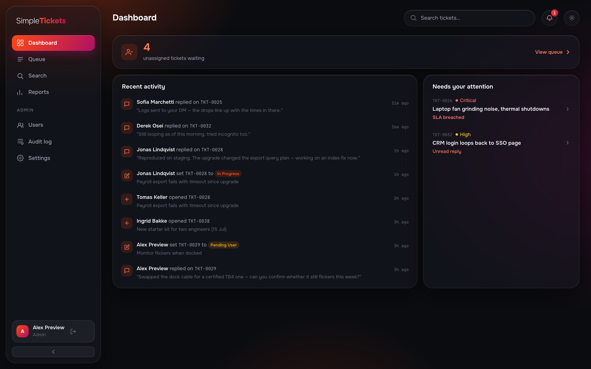
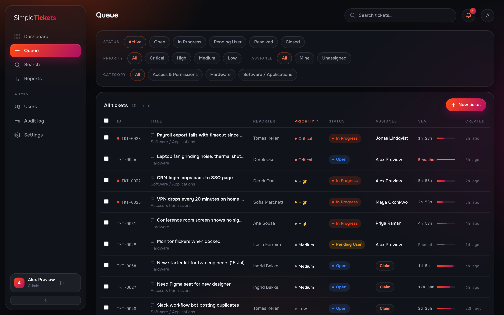
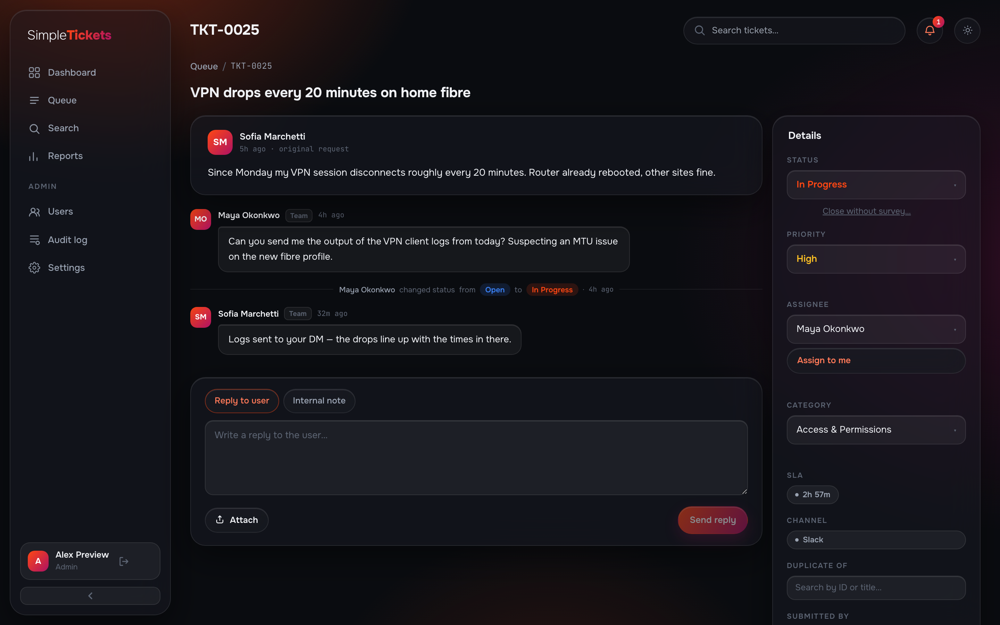
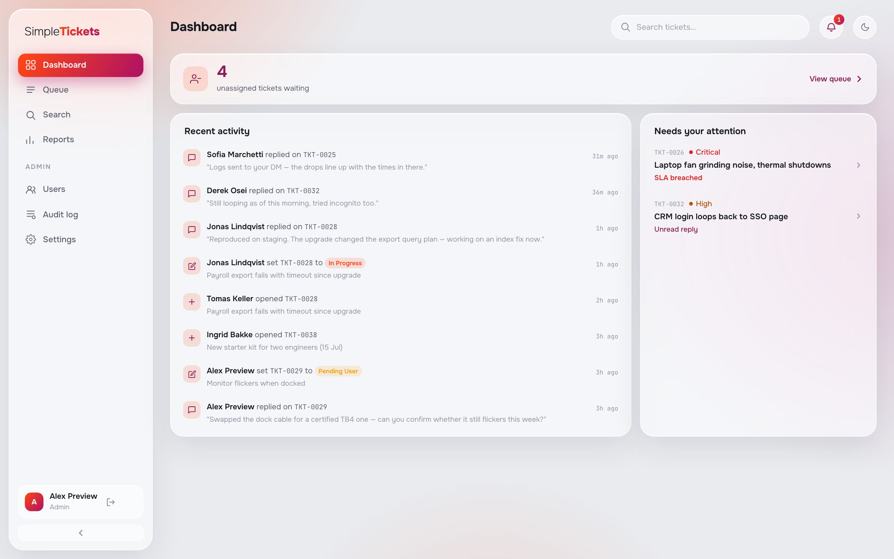
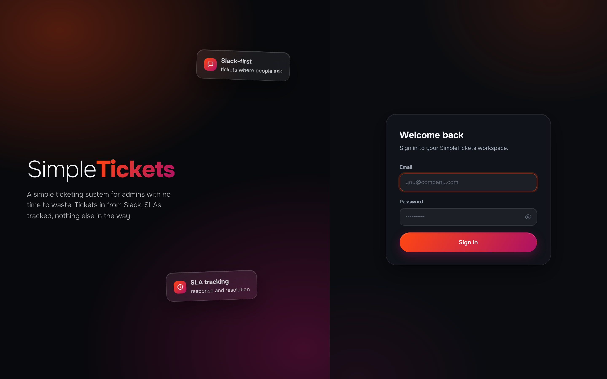

# Simple**Tickets**

A self-hosted, Slack-first helpdesk for small IT teams. End users submit and track
tickets entirely through Slack — no portal account required. Technicians work the
queue through a web UI.

Part of a suite of simple, self-hosted ops tools: each app does one thing well,
runs from a single `docker compose up`, and needs zero configuration to start.



## What it does

- **Slack-first intake** — four creation paths: DM the bot, react with an emoji,
  `/ticket`, or the App Home tab; images and files flow in both directions
- **Two-way thread sync** — web replies post to the Slack thread automatically,
  and vice versa; submitters are DM'd on every reply and field update
- **SLA tracking** — per-priority policies for first response and resolution,
  pause/resume on configurable statuses, breach warnings DM'd to the team
  15 minutes before a deadline
- **Queue** — filterable by status, priority, assignee, and category; sortable
  columns; live SLA countdown meters; bulk assign, prioritize, and resolve
- **Ticket detail** — public replies, internal notes, attachments, and a full
  conversation timeline with field-change events interleaved by timestamp
- **CSAT surveys** — thumbs up/down sent on resolution; negative feedback
  reopens the ticket and surfaces on the dashboard
- **Reports** — volume, priority, status, category, and channel breakdowns,
  technician performance with SLA compliance, CSV export
- **Full-text search** — across titles, descriptions, and reply bodies
- **Admin without config files** — users, statuses, categories, SLA policies,
  Slack credentials, and backup/restore all managed from a tabbed settings page





Dark and light themes, toggled from the top bar — the choice persists per user.





## Quick start

```bash
git clone https://github.com/gillesdelhaes/SimpleTickets.git
cd SimpleTickets
docker compose up -d
```

Open **http://localhost:3000** — the setup wizard runs on first launch, creates
your admin account, and optionally connects Slack. No config files, no env vars.

## Slack setup

SimpleTickets uses a **private Slack app** in your workspace running over Socket
Mode — no public webhook URL or port forwarding needed. Both the setup wizard and
**Settings → Slack** include a copy-paste app manifest that configures every
scope, event, and command automatically; you only paste back three tokens.

## Backups

There are two separate things to back up, and they don't overlap on purpose.

**Data** — tickets, users, settings, attachments — via `Settings → Backup` in
the admin UI, or the same endpoint from a script: `GET /api/admin/backup`
(admin-only, streams a zip). `scripts/backup.sh` wraps that for cron:

```bash
ST_ADMIN_EMAIL=admin@example.com \
ST_ADMIN_PASSWORD=your-password \
ST_BACKUP_DIR=/var/backups/simpletickets \
ST_BACKUP_KEEP=30 \
sh scripts/backup.sh
```

Crontab example — nightly at 2am, credentials kept out of the crontab line
itself via a root-owned, `chmod 600` env file:

```cron
0 2 * * * . /etc/simpletickets/backup.env && /path/to/simpletickets/scripts/backup.sh >> /var/log/simpletickets-backup.log 2>&1
```

```bash
# /etc/simpletickets/backup.env — chmod 600, owned by root
ST_URL=http://localhost:3000/api
ST_ADMIN_EMAIL=admin@example.com
ST_ADMIN_PASSWORD=your-password
ST_BACKUP_DIR=/var/backups/simpletickets
ST_BACKUP_KEEP=30
```

**Secrets** — the master encryption key and the Postgres password — are
deliberately **excluded** from that backup, so a leaked backup zip alone
can't decrypt anything. They live in two Docker volumes, `app_secret` and
`db_secret`, and need their own, separate backup. They rarely change, but
losing them without a copy permanently orphans every encrypted Slack token
and the JWT signing key, even with the database fully intact:

```bash
docker run --rm \
  -v simpletickets_app_secret:/from/app_secret:ro \
  -v simpletickets_db_secret:/from/db_secret:ro \
  -v "$(pwd)":/backup \
  alpine sh -c "tar czf /backup/simpletickets-secrets-$(date -u +%Y%m%dT%H%M%SZ).tar.gz -C /from ."
```

Store that somewhere separate from the data backups — keeping both in the
same place recreates the single-failure-domain problem this split exists to
avoid. Run it whenever you rotate credentials, and once after first setup.

## Stack

- **Backend:** Python 3.12 + FastAPI, PostgreSQL 16, SQLModel + Alembic,
  Slack Bolt (Socket Mode)
- **Frontend:** React 18 + TypeScript, Vite, Tailwind CSS, TanStack Query, Recharts
- **Deploy:** 3 containers via Docker Compose (db + api + frontend); only the
  frontend port is exposed

## License

AGPL-3.0
